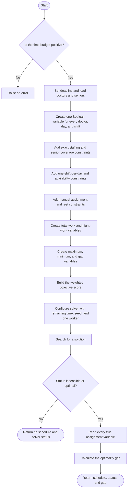

# CP-SAT algorithm flowchart

[Back to the project README](../README.md) · [View the implementation](../cp_sat.py)

CP-SAT describes the complete month as variables, constraints, and an
objective. OR-Tools then searches for a valid assignment with the lowest score.

CP-SAT stands for **Constraint Programming with Boolean Satisfiability**. It is
designed for problems containing choices, rules, and integer objectives.
Instead of assigning doctors one at a time, the program first describes the
entire scheduling problem mathematically.

## Building the model

For every doctor, day, and shift, the model creates a Boolean variable:

```text
x[doctor, day, shift] = 1  if the doctor works that shift
x[doctor, day, shift] = 0  otherwise
```

With 20 doctors, 30 days, and 3 shifts, this produces 1,800 assignment
variables. The hard rules become equations or inequalities. For example:

```text
sum of x for one shift = 4                 # exactly four doctors
sum of one doctor's shifts in a day <= 1  # at most one shift per day
night today + morning tomorrow <= 1        # required rest
```

The model also calculates each doctor's total and night workloads. It asks the
solver to minimize holiday violations and workload gaps using the common score.
The solver explores possible assignments, rejects groups of choices when the
constraints make them impossible, and remembers the best solution found.

## Flowchart



## Solver results and tradeoffs

Unlike Greedy, CP-SAT can reconsider interacting choices across the entire
month. This usually produces stronger schedules, but searching and proving that
a solution is best takes time. The deadline starts before model construction,
so building the model is part of the budget.

- `OPTIMAL`: a best possible schedule was found and proved optimal.
- `FEASIBLE`: a valid schedule was found, but a better one might exist.
- `UNKNOWN`: the time limit ended before the solver established either result.
- `INFEASIBLE`: the rules were proved impossible to satisfy together.
