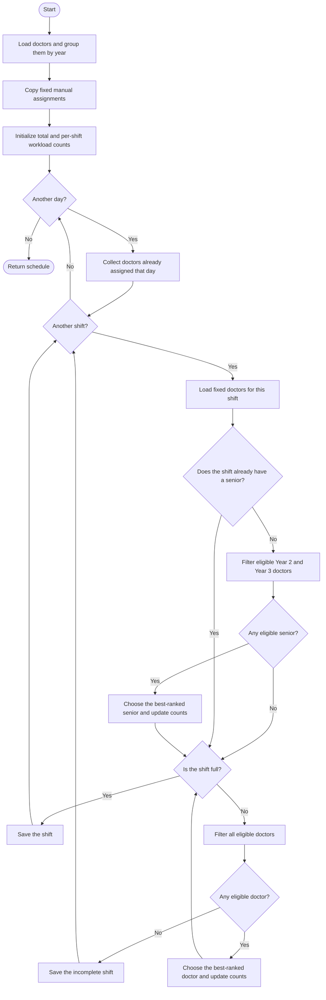

# Greedy algorithm flowchart

[Back to the project README](../README.md) · [View the implementation](../greedy.py)

The Greedy scheduler fills the calendar from the first day to the last. At
each position, it chooses the eligible doctor with the best current rank and
never revisits that choice.

A greedy algorithm repeatedly makes the choice that looks best **right now**.
It is similar to filling seats row by row: after choosing a person for one
seat, it moves to the next seat without reconsidering the earlier decision.

## How it works

1. Copy all fixed manual assignments into the schedule.
2. Visit each day, then its morning, day, and night shifts.
3. Remove doctors who are unavailable or would break a hard rule.
4. If the shift does not have a Year 2 or Year 3 doctor, choose one first.
5. Rank the remaining eligible doctors and fill the open positions.

Doctors are ranked by these priorities, in order:

1. Avoid assigning someone on a requested holiday.
2. Prefer the doctor with fewer total assignments.
3. Prefer the doctor with fewer assignments of this shift type.
4. Use the doctor ID to break an exact tie reproducibly.

## Flowchart

## Strengths and limitations

An eligible doctor must be available, not already assigned that day, rested
after a night shift, and below the consecutive-night limit. Ranking prefers no
holiday conflict, fewer total shifts, fewer shifts of the current type, and
finally the lower doctor ID as a stable tie-breaker.

Greedy is fast because each position requires only filtering and ranking a
small list. Its weakness is that a locally sensible choice may create a problem
later. It does not backtrack to repair earlier choices, so it may leave a shift
incomplete even when rearranging earlier assignments could complete it.
