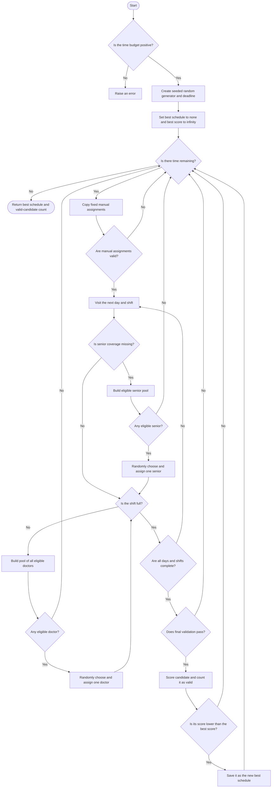

# Monte Carlo algorithm flowchart

[Back to the project README](../README.md) · [View the implementation](../monte_carlo.py)

The Monte Carlo scheduler repeatedly builds random schedules, rejects invalid
ones, and remembers the valid schedule with the lowest score.

Monte Carlo methods use repeated random trials. A simple analogy is shuffling a
deck many times, scoring each order, and keeping the best order seen. More time
allows more trials, but does not guarantee the best possible result.

## How it works

For each candidate schedule, this implementation:

1. Starts with the fixed manual assignments.
2. Visits each day and shift in order.
3. Randomly selects an eligible senior if senior coverage is still needed.
4. Randomly selects eligible doctors until the shift is full.
5. Discards the candidate if it reaches a dead end or fails final validation.
6. Scores every valid candidate and remembers the best one.

This loop continues until the budget expires. `valid_candidates` in the result
CSV shows how many complete schedules survived validation. The random seed
makes the sequence of choices repeatable, although faster computers may test
more candidates within the same time.

## Flowchart

## Strengths and limitations

Eligibility uses the same availability, daily assignment, rest, and
consecutive-night rules as the other algorithms. A candidate that reaches a
dead end is discarded rather than repaired. Because the deadline is checked
between candidates, the run may exceed its budget slightly while finishing one
candidate.

Monte Carlo explores different parts of the solution space without building a
mathematical solver model. However, random selection ignores which choice is
likely to improve the score, so it can require many trials and may still lose
to the much faster Greedy heuristic.
